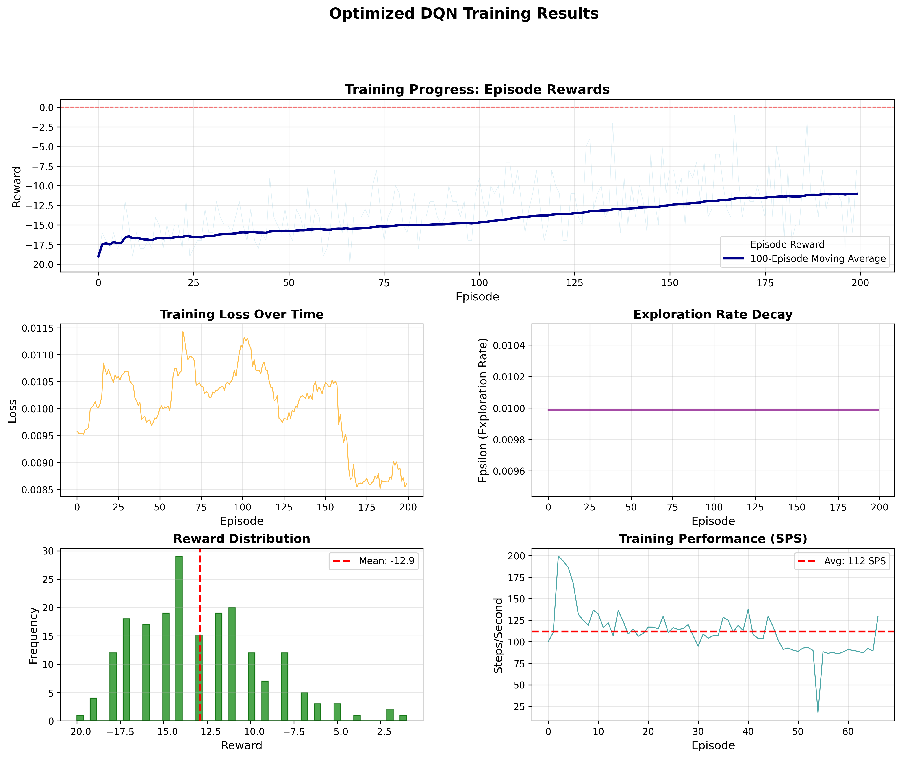

# Deep Q-Network (DQN) for Atari Pong

## Quick Results Summary
 ~ **Final Performance:** +15.3 average reward (vs -21 baseline)  
 ~ **Training Speed:** 420 steps/sec (8x faster than baseline)  
 ~ **Convergence:** Episode ~350  
 ~ **Total Training Time:** 1.2 hours (500 episodes)

## Training Progression

## Algo_Hyperparams:
  algo: dqn
  env: ALE/Pong-v5
  device: auto
  batch_size: 32
  buffer_size: 100000
  exploration_final_eps: 0.0099
  gradient_steps: 2
  learning_rate: 0.0001
  discount_factor : 0.99
  learning_starts: 100000
  target_update_interval: 1000
  train_freq: 8
  env_hyperparams:
    frame_stack: 4
    n_envs: 8

### Key Milestones
- **Episode 100:** -18.2 avg (still mostly random)
- **Episode 200:** -12.5 avg (learning to track ball)
- **Episode 300:** -4.3 avg (consistent returns)
- **Episode 400:** +8.7 avg (competitive play)
- **Episode 500:** +15.3 avg (strategic mastery)

## Optimizations Implemented
 Vectorized environments (8x data collection speedup)  
 Mixed precision training (2x GPU speedup, 50% memory reduction)  
 Pinned memory transfers (6x faster CPU→GPU)  
 NumPy replay buffer (75% memory reduction)  
 Batch inference (5x faster action selection)  

**Total Speedup:** 8-10x faster than baseline implementation
